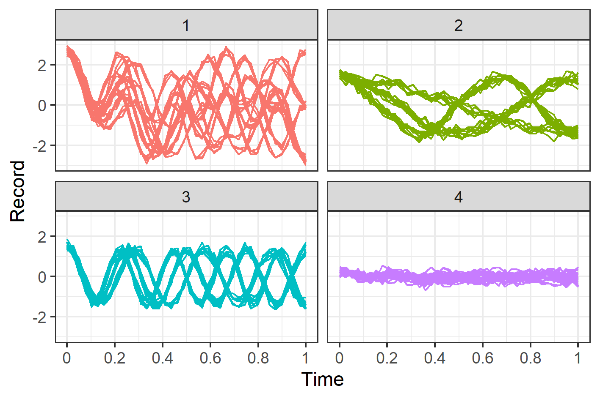

# Projection-Clustering
This repository contains supporting codes for manuscript *Bayesian clustering using random effects models and predictive projections*.

## Abstract
Linear mixed models are widely used for analyzing 
hierarchically structured datasets involving missingness and unbalanced study designs.  
	For clustering of complex longitudinal datasets, it is common to use mixture or partition models with linear mixed model
	components.  However, computation and model choice for these models is challenging.   
	Here we consider an alternative Bayesian clustering method 
	that combines linear mixed models and predictive projections.  For each observation, a predictive replicate
	is considered in which only a subset of the random effects is shared between the observation and its replicate,
	with the remainder being integrated out using the conditional prior.  Predictive projections are then defined 
	in which the number of distinct values taken by the shared random effects is finite, in order to obtain different 
	clusters. 
	The proposed method can also
	account for clustering uncertainty through the posterior distribution of the projection.
	To illustrate the way our method reveals
	aspects of the data at different scales,  we consider fitting temporal
	trends in longitudinal data using Fourier cosine bases with a random
	effect for each basis function, and different clusterings defined by shared random effects for replicates
	of low or high frequency
	terms.  The method is demonstrated in a series of real examples.
  
## Examples
1. Synthetic dataset 
    1. 
    2. 
2. [Crop image](https://www.cs.ucr.edu/%7Eeamonn/time_series_data_2018/)
4. [DNA synchrony of yeast cells](http://genome-www.stanford.edu/cellcycle/)
5. [EEG signals during sleep](https://physionet.org/content/capslpdb/1.0.0/)
6. [Activity recognition from accelerometer data](https://archive.ics.uci.edu/ml/datasets/Activity+Recognition+from+Single+Chest-Mounted+Accelerometer)

To recreate analysis described in manuscript, enter example-specific subfolder and run code.
