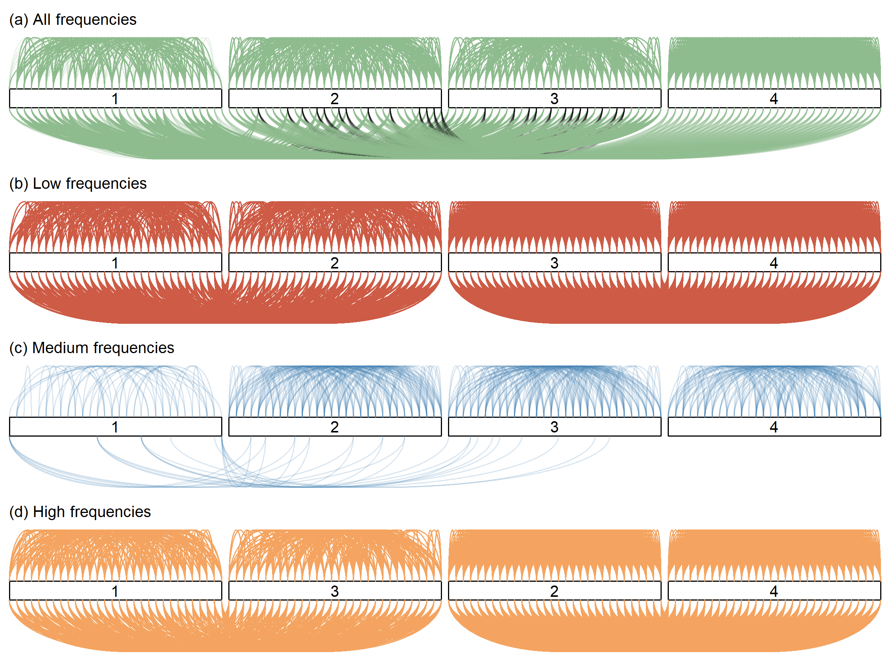

# Projection-Clustering
This repository contains supporting codes for manuscript *Bayesian clustering using random effects models and predictive projections*.
  
## Examples
1. Synthetic dataset 
    1. Data observations
    2. Clustering probabilities 
2. [Crop image](https://www.cs.ucr.edu/%7Eeamonn/time_series_data_2018/)
4. [DNA synchrony of yeast cells](http://genome-www.stanford.edu/cellcycle/)
5. [EEG signals during sleep](https://physionet.org/content/capslpdb/1.0.0/)
6. [Activity recognition from accelerometer data](https://archive.ics.uci.edu/ml/datasets/Activity+Recognition+from+Single+Chest-Mounted+Accelerometer)

To recreate analysis described in manuscript, enter example-specific subfolder and run code.
